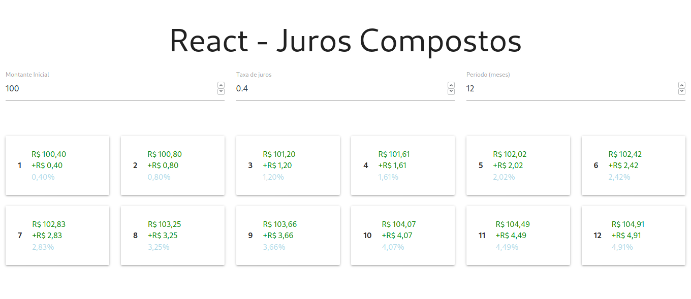

# Objetivo

Exercitar os seguintes conceitos trabalhados no Módulo:

- Implementação de algoritmos com JavaScript;
- Criação de componentes com React.
- Utilização de class components, functional components ou hooks.

## Atividade

Os alunos deverão desempenhar as seguintes atividades:

1. Criar o projeto com o pacote create-react-app ou utilizar o projeto \_react-projeto-base já disponibilizado pelo professor no fórum do módulo. 
Essa última é a forma recomendada pelo professor.
2. Definir os elementos que farão parte do estado da aplicação.O estado da
   aplicação deve ser composto do valor inicial, a taxa de juros mensale o período. A taxa de juros pode ser tanto positiva (investimento) quanto negativa (depreciação). A implementação da manipulação do estado da aplicação pode ser feita tanto com class components quanto hooks, ficando a escolha a critério do aluno.Entretanto, as questões do desafio serão elaboradas com base em conceitos e implementação referentes somente aos React Hooks.

# Resultado

