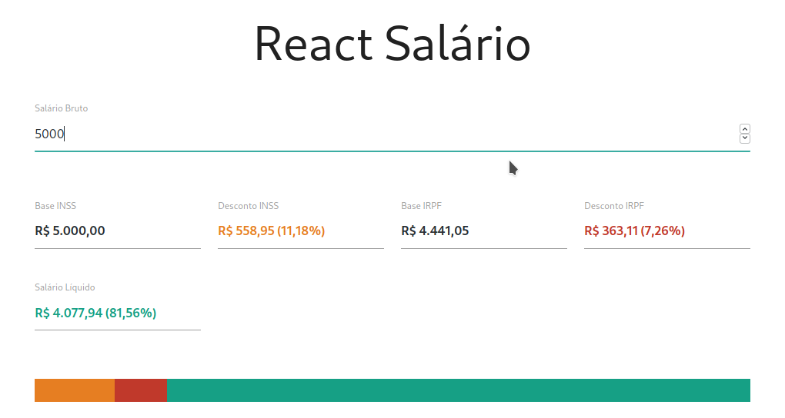

# Objetivo

Exercitar os seguintes conceitos trabalhados no módulo:
- Implementação de aplicações com JavaScript e React
- Criação de Class Components

## Atividade

Construa, utilizando React, uma aplicação para a calcular o salário líquido a partir do salário bruto, considerando as regras da CLT de 2020.
Os alunos deverão implementar, utilizando React, uma aplicação denominada "react-salario" que possuirá um input editável e diversos outros inputs somente-leitura para exibir informações sobre o cálculo de salário conforme as leis da CLT em 2020. Só devem ser considerados os cálculos de desconto de INSS e IRPF, ou seja, outros descontos e dependentes devem ser ignorados. Os valores a serem exibidos são:

- Salário bruto (editávelpelo usuário).
- Base INSS (somente-leitura).
- Desconto INSS (somente-leitura).
- Base IRPF (somente-leitura).
- Desconto IRPF (somente-leitura).
- Salário líquido (somente-leitura).

# Resultado

